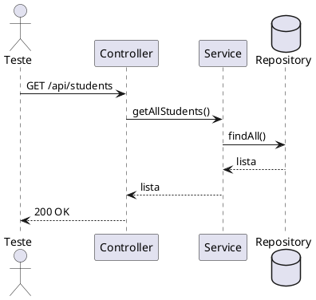

# Guia de Testes e Cobertura

Este documento descreve, de forma objetiva, como:
- executar os testes automatizados do projeto;
- gerar o relatório de cobertura;
- ler e interpretar o relatório HTML do JaCoCo.

## 1. Pré-requisitos

- Java 17 ou superior
- Maven 3.6+ (ou usar o wrapper `./mvnw`)

Valide no terminal:

```bash
java -version
mvn -version
```

## 2. Estrutura de testes atual

Os testes estão organizados em:

- `src/test/java/com/example/educationalqualityproject/service`
  - testes unitários de regras de negócio (`StudentServiceTest`, `TeacherServiceTest`)
- `src/test/java/com/example/educationalqualityproject/controller`
  - testes de controller MVC (`HomeControllerTest`, `StudentControllerTest`, `TeacherControllerTest`)
- `src/test/java/com/example/educationalqualityproject/e2e`
  - testes end-to-end da API com `MockMvc` (`StudentApiE2ETest`, `TeacherApiE2ETest`)

## 2.1 Diagramas UML de sequencia (imagens)

Fonte textual completa:
- `uml-sequencia.md`

Imagens renderizadas:

### TeacherServiceTest


### StudentControllerTest


### TeacherControllerTest


### StudentApiE2ETest


### TeacherApiE2ETest


## 3. Executar apenas os testes

Para rodar somente a suíte de testes:

```bash
mvn test
```

Ou com wrapper Maven:

```bash
./mvnw test
```

Resultado esperado:
- build finaliza com `BUILD SUCCESS`;
- relatórios de execução (Surefire) em `target/surefire-reports/`.

## 4. Gerar relatório de cobertura (HTML)

O projeto já está configurado com `jacoco-maven-plugin` no `pom.xml`.

Para executar testes + gerar cobertura:

```bash
mvn clean verify
```

Ao final, o relatório HTML é gerado em:

- `target/site/jacoco/index.html`

Arquivos adicionais úteis:

- `target/site/jacoco/jacoco.csv` (dados tabulares)
- `target/site/jacoco/jacoco.xml` (integração com ferramentas)

## 5. Como abrir o relatório HTML

No Linux (WSL/Ubuntu), você pode abrir no navegador com:

```bash
xdg-open target/site/jacoco/index.html
```

Se estiver em ambiente sem interface gráfica, abra o arquivo manualmente no navegador do seu sistema.

## 6. Como ler o relatório de cobertura

Na página `index.html` do JaCoCo:

1. Veja a linha `Total` para a cobertura global.
2. Clique em cada pacote para detalhar por classe.
3. Clique na classe para ver linhas cobertas e não cobertas no código.

Principais colunas:

- `Instructions`: cobertura de instruções executadas.
- `Branches`: cobertura de decisões (`if/else`, fluxos condicionais).
- `Lines`: cobertura por linha.
- `Methods`: métodos executados ao menos uma vez.
- `Classes`: classes tocadas pelos testes.

Regra prática:
- `Methods` alto com `Branches` baixo geralmente indica falta de cenários alternativos (erros, conflitos, caminhos negativos).

## 7. Fluxo recomendado no dia a dia

1. Escreva/ajuste testes.
2. Rode `mvn test` para feedback rápido.
3. Rode `mvn clean verify` antes de finalizar.
4. Abra `target/site/jacoco/index.html` e analise os pontos sem cobertura.
5. Adicione testes para os ramos ausentes e repita.

## 8. Troubleshooting rápido

### 8.1 Log de conexão Mongo (`Connection refused`) durante testes

Pode aparecer em alguns testes de contexto Spring. Isso não bloqueia a suíte quando os cenários são mockados corretamente.

### 8.2 Falha por contexto Spring não subir

Verifique:
- configurações de teste em `src/test/resources/application.properties`;
- uso correto de `@WebMvcTest`, `@SpringBootTest`, `@AutoConfigureMockMvc`;
- mocks necessários para dependências dos controllers/services.

### 8.3 Relatório de cobertura não foi gerado

Confirme:
- execução com `mvn clean verify` (não apenas `mvn test`);
- plugin JaCoCo presente no `pom.xml`;
- existência de `target/site/jacoco/index.html` ao final.

## 9. Comandos de referência

```bash
# Executar testes
mvn test

# Executar testes e gerar cobertura HTML
mvn clean verify

# Executar uma classe de teste específica
mvn -Dtest=StudentApiE2ETest test

# Executar um método específico
mvn -Dtest=StudentApiE2ETest#shouldCreateStudent test
```

## 10. Alternativa com PlantUML (site)

Tambem e possivel gerar os diagramas pelo site do PlantUML.

Passo a passo:

1. Acesse: `https://www.plantuml.com/plantuml/uml/`
2. Escreva ou cole o diagrama no formato PlantUML, entre `@startuml` e `@enduml`.
3. Clique em `Submit` para renderizar.
4. Baixe a imagem gerada (PNG/SVG) pelo proprio viewer.
5. Salve em `docs/uml/` e referencie no `README.md` com ``.

Exemplo minimo em PlantUML:


